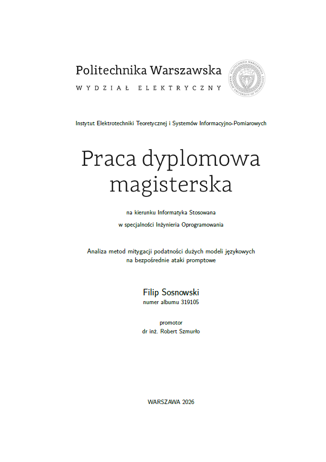

# Master's Thesis: Analysis of methods for mitigating the vulnerability of large language models to direct prompting attacks

## Abstract

The development of large language models (LLM) has led to their widespread implementations
across information technology systems. However, these models remain vulnerable to direct prompting
attacks, which aim to bypass built-in security mechanism. The aim of this thesis was to conduct
a comparative analysis and evaluation of three distinct methods for mitigating vulnerability to direct
attacks. These were the Self-Reminder technique based on prompt engineering, a solution utilising the
external Llama-Guard classifier, and a method based on activation engineering. The research aimed to
identify a solution offering an optimal balance between safety, computational overhead and model’s
usability. The experiments were conducted on the Llama-3.1-8B-Instruct and Mistral-7B-Instruct-v0.3
models. These were subjected to a variety of attack vectors, such as DAN, GCG and PAIR. The
JBB-Behaviours dataset was utilised, which contained malicious prompts. Mitigation methods were
evaluated based on attack success rates (ASR), over-refusal rates (ORR), and the MMLU test
measuring the model’s general capabilities, whilst latency was assessed using the TTFT and TBT
metrics. The research carried out made it possible to determine the vulnerability of the models under
investigation to specific types of attacks, as well as the effectiveness of the defence mechanisms
implemented. The results showed that the method based on activation steering proved to be the most
advantageous of the solutions tested for the Llama model, providing a level of security comparable
to that of an external moderating model, with negligible memory overhead, causing only a slight
increase in latency and preserving the model’s overall capabilities. At the same time, this method
did not provide sufficient protection for the Mistral model, indicating that its effectiveness depends
on the model’s characteristics. Llama-Guard provided a high level of protection regardless of the
model family. However, it introduced significant latency and additional memory overhead. The results
obtained for the Self-Reminder technique, on the other hand, indicated that prompt engineering does
not provide sufficient protection against the analysed attacks. Ultimately, it was established that the
selection of defence mechanisms is not universal and should take into account the specific nature of
the infrastructure, its intended use, and security and performance requirements.

## Materials and methods

- NVIDIA A40 (48GB VRAM)
- Python 3.12.3
- PyTorch
- Hugging Face
- Llama-3.1-8B-Instruct
- Mistral-7B-Instruct-v0.3
- Llama-Guard
- JailbreakBench
- HarmBench
- BeaverTails
- Pandas
- NumPy
- Attacks: DAN, GCG, PAIR
- Defenses: Activation Engineering, Input/Output moderation classifier, Prompt Engineering
